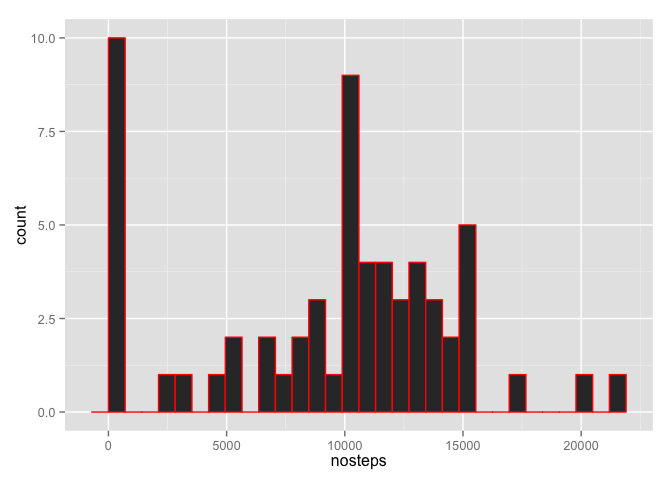
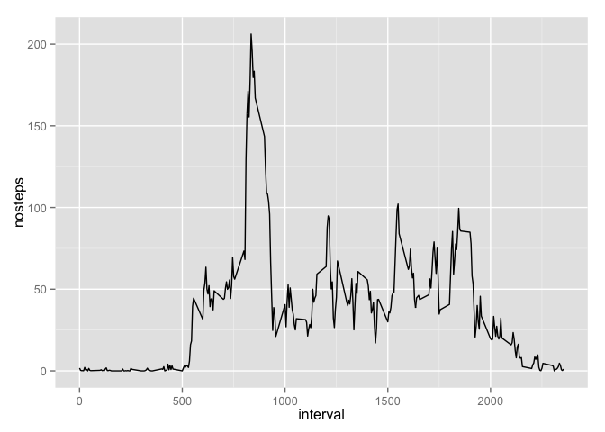
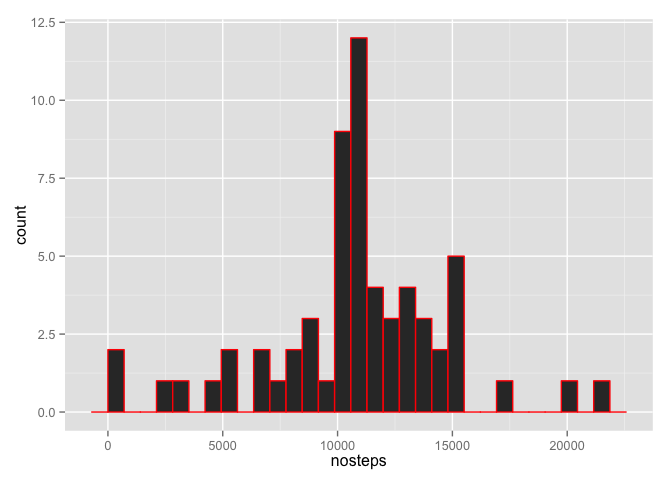
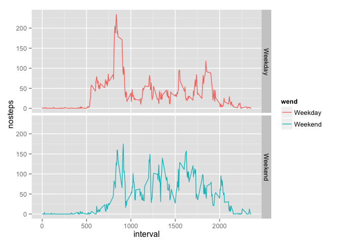

# Reproducible Research: Peer Assessment 1


## Loading and preprocessing the data

Read data from csv.


```r
activity <- read.csv("activity.csv")
summary(activity)
```

```
##      steps                date          interval     
##  Min.   :  0.00   2012-10-01:  288   Min.   :   0.0  
##  1st Qu.:  0.00   2012-10-02:  288   1st Qu.: 588.8  
##  Median :  0.00   2012-10-03:  288   Median :1177.5  
##  Mean   : 37.38   2012-10-04:  288   Mean   :1177.5  
##  3rd Qu.: 12.00   2012-10-05:  288   3rd Qu.:1766.2  
##  Max.   :806.00   2012-10-06:  288   Max.   :2355.0  
##  NA's   :2304     (Other)   :15840
```

Converting the date from string to Date format

```r
activity$date <- as.Date(activity$date, format = "%Y-%m-%d")
```

## What is mean total number of steps taken per day?

Historgrams for the number of steps table per day with mean and median

```r
library(data.table)
library(ggplot2)
DT <- data.table(activity)
group_by_day <- DT[, sum(steps, na.rm=TRUE), by=date ]
setnames(group_by_day, "V1", "nosteps")
ggplot(group_by_day, aes(x = nosteps)) + geom_histogram(colour = "red")
```

```
## stat_bin: binwidth defaulted to range/30. Use 'binwidth = x' to adjust this.
```

 

```r
mean(group_by_day$nosteps)
```

```
## [1] 9354.23
```

```r
median(group_by_day$nosteps)
```

```
## [1] 10395
```


## What is the average daily activity pattern?

* Group the data by interval and average over all the days.
* Remove NAs when computing mean


```r
group_by_time <- DT[, mean(steps, na.rm=TRUE), by=interval ]
setnames(group_by_time, "V1", "nosteps")
ggplot(group_by_time, aes(x = interval, y = nosteps)) + geom_line()
```

 

The Interval in which there was maximum number of steps

```r
group_by_time[nosteps == max(group_by_time$nosteps), ][["interval"]]
```

```
## [1] 835
```

## Imputing missing values

Total number of missing values

```r
nrow(activity[is.na(activity$steps),])
```

```
## [1] 2304
```

For removing the missing values we find the mean steps for that interval over all the days and replace the missing value with that

```r
group_by_time <- DT[, mean(steps, na.rm=TRUE), by=interval ]
setnames(group_by_time, "V1", "nosteps")
```

Creating the new dataframe from existing dataframe after removing missing values

```r
new_activity <- activity

for (n in 1: nrow(new_activity))
{
    if(is.na(new_activity$steps[n]))
    {
        new_activity$steps[n] <- group_by_time[group_by_time$interval == new_activity$interval[n],]$nosteps
    }
}

nrow(new_activity[is.na(new_activity$steps),])
```

```
## [1] 0
```

Similar histograms as in Question 1

```r
DT <- data.table(new_activity)
group_by_day <- DT[, sum(steps, na.rm=TRUE), by=date ]
setnames(group_by_day, "V1", "nosteps")
ggplot(group_by_day, aes(x = nosteps)) + geom_histogram(colour = "red")
```

```
## stat_bin: binwidth defaulted to range/30. Use 'binwidth = x' to adjust this.
```

 

```r
mean(group_by_day$nosteps)
```

```
## [1] 10766.19
```

```r
median(group_by_day$nosteps)
```

```
## [1] 10766.19
```
You can notice a few changes

  * Mean and Median are slightly higher
  * Lots of days when there are 0 steps decreased
  * The graph looks more like normal distribution now

## Are there differences in activity patterns between weekdays and weekends?

Creating a factor variable for weekday and weekend

```r
activity$wend <- as.factor(ifelse(weekdays(activity$date) %in% c("Saturday","Sunday"), "Weekend", "Weekday") )
```

```r
DT <- data.table(activity)


group_by_time <- DT[, mean(steps,na.rm=TRUE), by=c("interval","wend")]
setnames(group_by_time, "V1", "nosteps")
ggplot(group_by_time, aes(x = interval, y = nosteps)) + geom_line(aes(color = wend)) + facet_grid(wend ~ .)
```

 

You can infer a new key differences with these plots

  * He starts to walk earlier during weekdays
  * But in weekends he ends up having much more steps overall
  * He stops walking later during weekends
